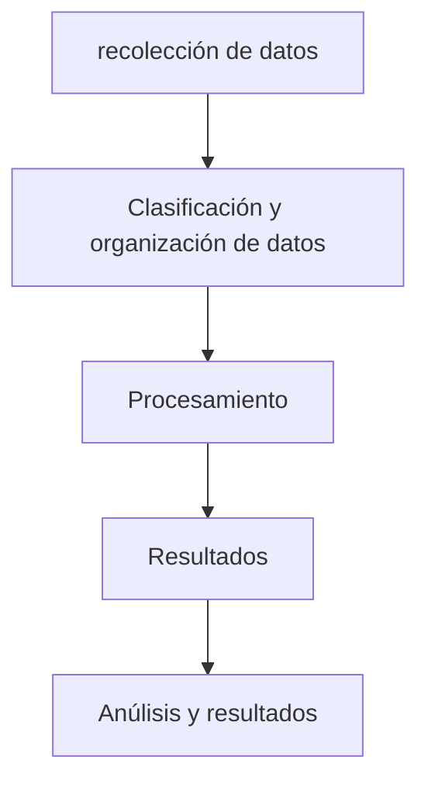
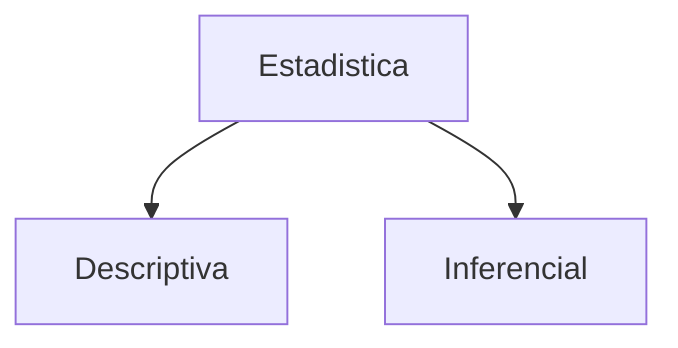
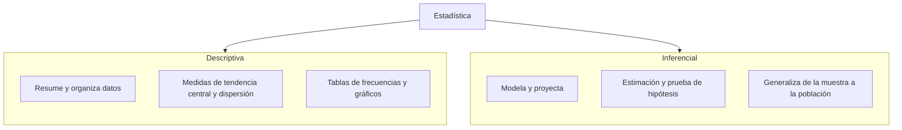

# Estadística descriptiva y conceptos básicos
## ¿Qué hace la estadística?


## ramas de la estadística




# Estadística Descriptiva y Conceptos Básicos

## ¿Qué hace la estadística?
La estadística es la ciencia que proporciona métodos para transformar datos brutos en información útil para la toma de decisiones.


> [!info] Definición
> La **Estadística Descriptiva** se enfoca en las etapas de recolección hasta la presentación, mientras que la **Estadística Inferencial** abarca la interpretación y toma de decisiones sobre una población a partir de una muestra.

---

## Ramas de la estadística



> [!tip] Regla rápida
> * Si describe lo que **ya pasó** en el conjunto de datos $\to$ **Descriptiva**.
> * Si concluye sobre lo que **no se ha medido directamente** con cierto margen de error $\to$ **Inferencial**.
> 
> 

```

---

### Por qué esta estructura es superior
1. **Aprovecha tus Callouts Obsidian recién arreglados**: Usa `[!info]` y `[!tip]` para fijar los conceptos clave alrededor del diagrama.
2. **Dirección natural (`flowchart LR`)**: El ciclo del dato se lee de izquierda a derecha de forma fluida sin ocupar tanta altura vertical innecesaria.
3. **Subgrafos en las ramas**: Desglosa en 2 o 3 puntos qué compone cada rama, convirtiendo el diagrama en una herramienta de repaso real y no solo en un esquema decorativo[cite: 1].

```