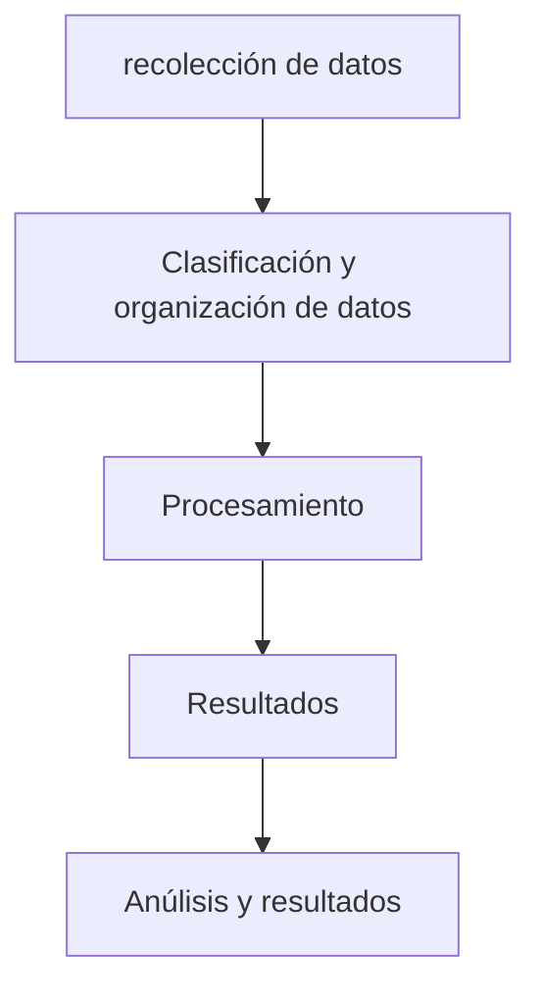
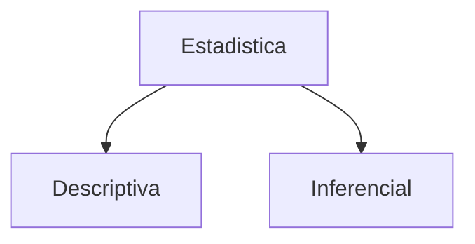

# Estadística descriptiva y conceptos básicos
## ¿Qué hace la estadística?

```mermaid
flowchart TB
A[recolección de datos]
B[Clasificación y organización de datos]
C[Procesamiento]
D[Resultados]
E[Anúlisis y resultados]

A --> B
B --> C
C --> D
D --> E
```
## ramas de la estadística

```mermaid
%%layout: pan-x%%
graph TB
B[Descriptiva]
A[Estadistica] --> B
A --> C[Inferencial]
```

