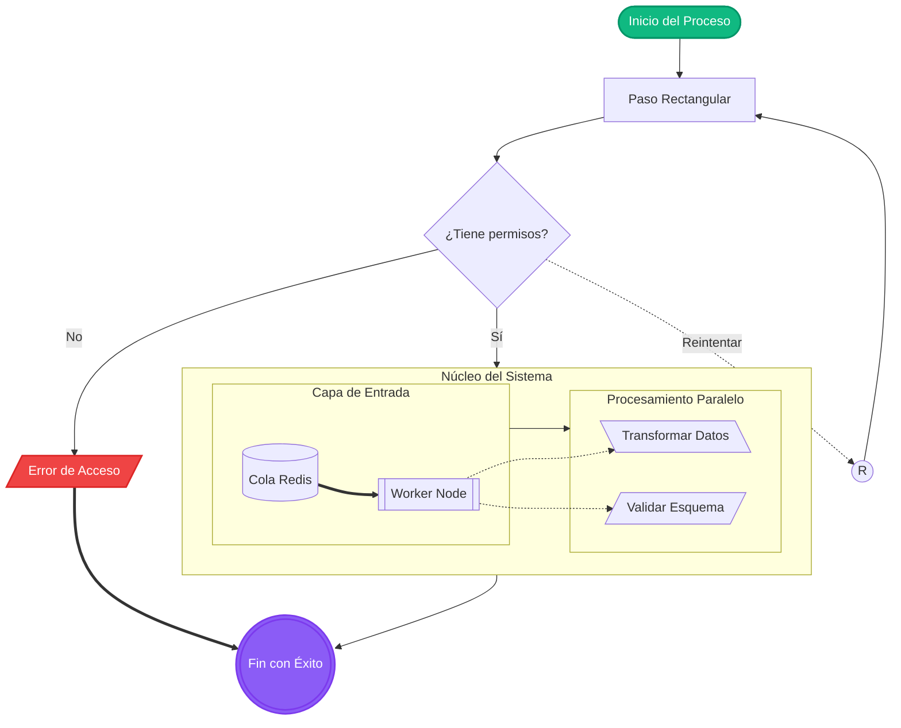
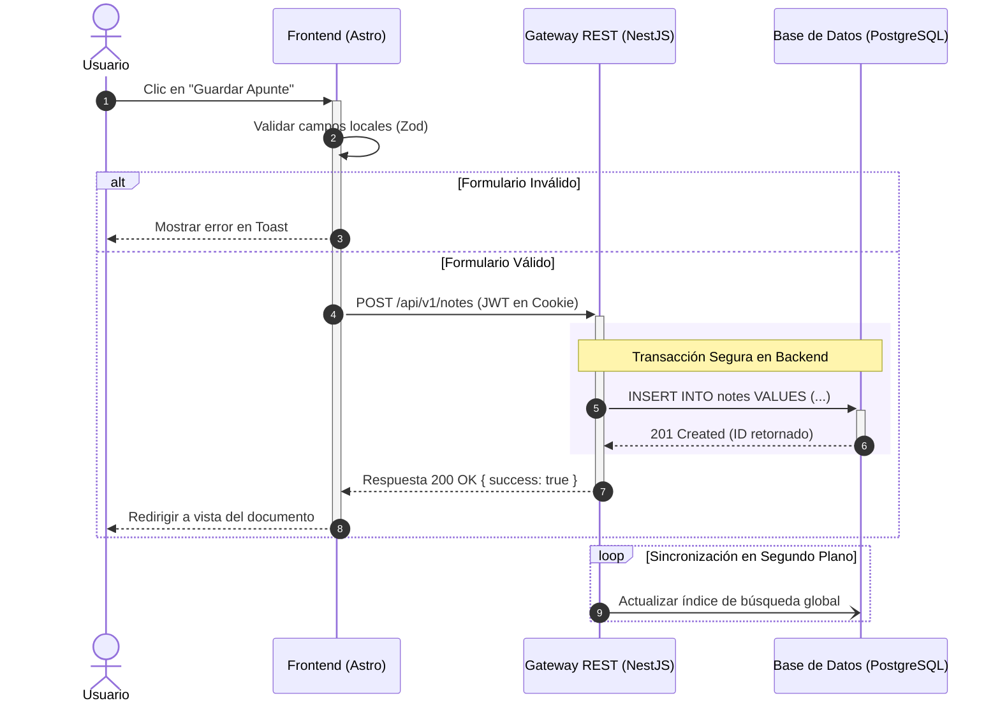
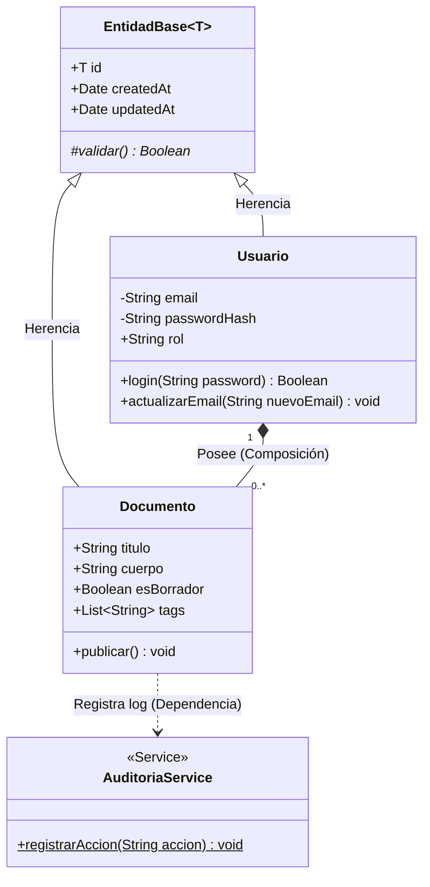
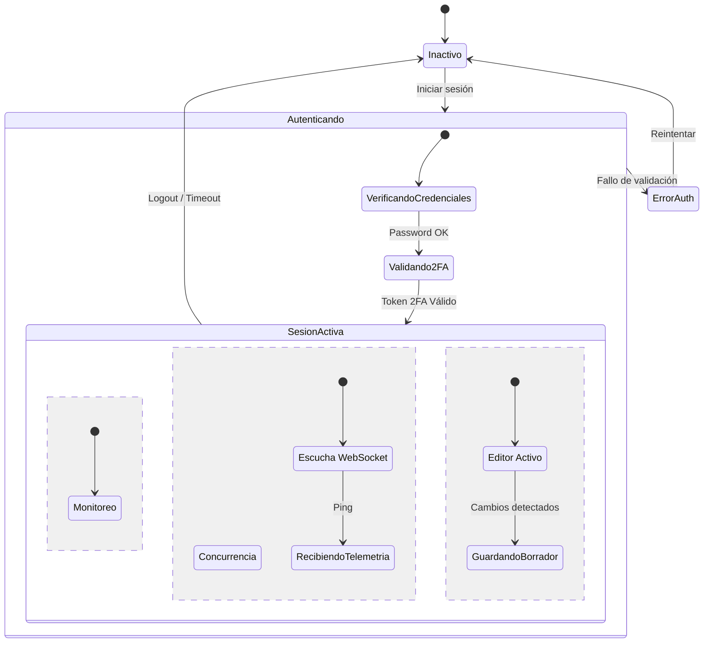
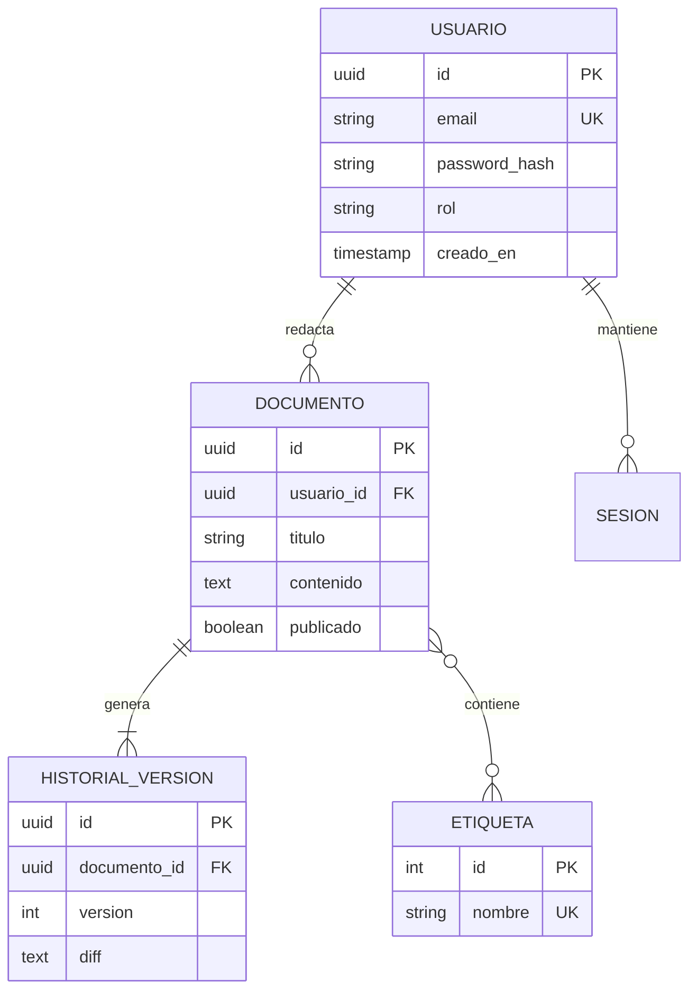
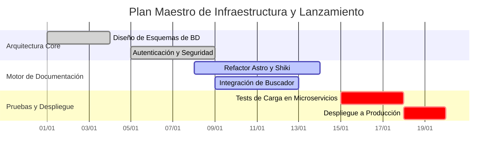
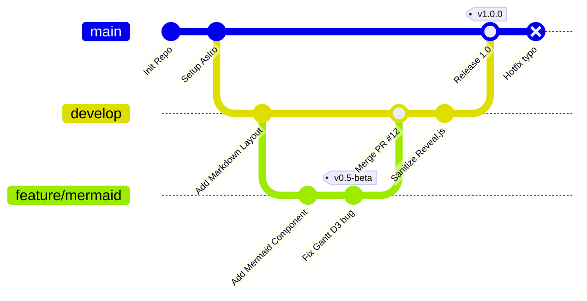
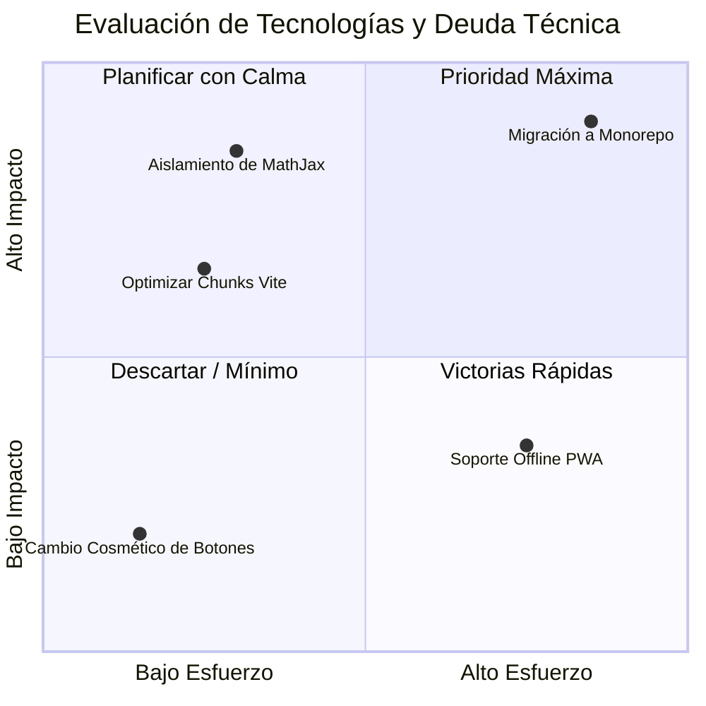
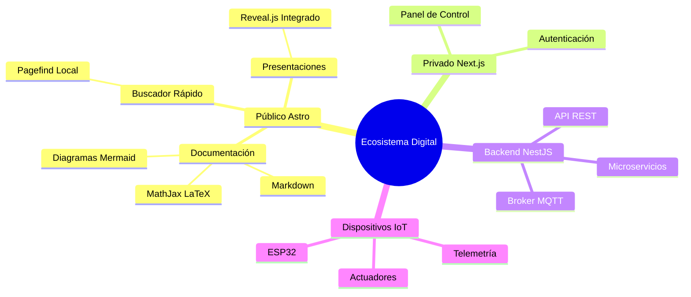
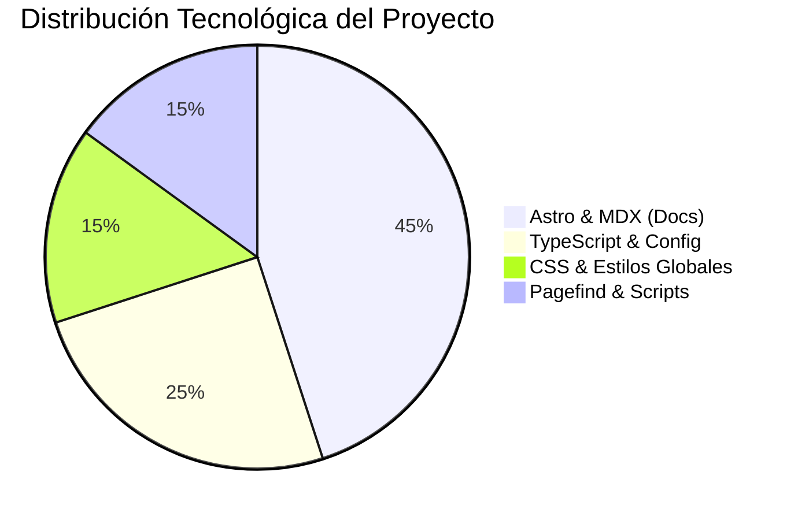

# 🧪 Suite de Pruebas y Límites: Mermaid
## 1. Flowchart Complejo con Subgraphs

---

## 2. Diagrama de Secuencia con Agrupaciones y Bucles

---

## 3. Diagrama de Clases (Tipos y Relaciones)

---

## 4. Máquina de Estados con Concurrencia

---

## 5. Diagrama Entidad-Relación

---

## 6. Diagrama de Gantt

---

## 7. Diagrama de Flujo Git (GitGraph)

---

## 8. Diagrama Cuadrante

---

## 9. Mapa Mental (Mindmap)

---

## 10. Diagrama Circular (Pie Chart)

