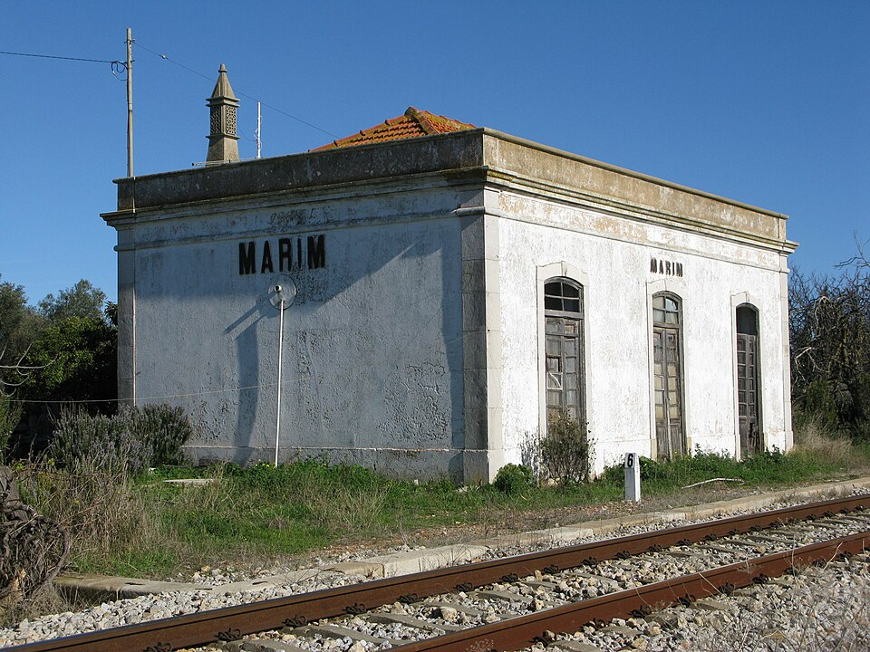

# Título Principal (H1)
Este documento prueba las capacidades visuales del repositorio. A continuación, evaluaremos cómo se renderizan los distintos niveles de jerarquía en el índice (TOC).

## Cabecera de Nivel 2 (H2)
El texto normal debe verse limpio y legible. Aquí probamos **negritas**, *cursivas*, y ~~texto tachado~~.

### Cabecera de Nivel 3 (H3)
Esta sección debería aparecer indentada correctamente en el panel izquierdo.

---

## 1. Avisos y Cajas de Información (Callouts)

El Markdown estándar no tiene "cajas de aviso" oficiales, pero podemos usar **Blockquotes** (Citas) convencionales, o inyectar HTML directamente para un control total.

> **ℹ️ Información**
> Este es un bloque de cita estándar de Markdown. Funciona muy bien para resaltar texto rápido.

Si quieres avisos personalizados con código y matemáticas, puedes usar HTML dentro del Markdown:

<div style="background: rgba(239, 68, 68, 0.1); border-left: 4px solid #ef4444; padding: 1rem; border-radius: 4px; margin-bottom: 1rem;">
  <strong>⚠️ Advertencia con Matemáticas y Código</strong>
  <p>El sistema puede renderizar KaTeX dentro de cajas HTML. Por ejemplo: $\frac{5}{2} = x^{2}$ y $\frac{a}{b}$.</p>
</div>

```python
variable = 2
if variable == 3:
    print("tu valor es 3")
else:
    print("tu valor es diferente de 3")

```

## 2. Bloques de Matemáticas (KaTeX)

Astro procesará esto usando `remark-math`.

**Fórmula en línea:** La ecuación de la relatividad es $E = mc^2$.

**Fórmula en bloque (Display):**

$$
f(x) = \int_{-\infty}^\infty \hat{f}(\xi)\,e^{2 \pi i \xi x} \,d\xi
$$

## 3. Manejo de Imágenes y Tamaños

**Imagen Markdown Estándar:** (Ocupa el 100% del ancho o su tamaño original)


**Imagen redimensionada con HTML:** (El Markdown puro no permite cambiar tamaños, debes usar la etiqueta `` indicando el `width`)


## 4. Gráficos SVG Interactivos/Animados

Puedes pegar código SVG puro en tu Markdown. Aquí tienes un círculo con una animación CSS simple incrustada:

## 5. Tablas

**Tabla Markdown Estándar:** (Rápida y limpia, pero sin celdas combinadas)

| Producto | Cantidad | Precio |
| --- | --- | --- |
| Teclado | 2 | $50.00 |
| Ratón | 5 | $25.00 |

**Tabla Avanzada con Celdas Combinadas:** (Requiere HTML, ideal para replicar Excel)

Guarda el archivo y ábrelo en tu navegador (`/docs/prueba-total`).

**¿Cómo se renderizó todo en tu pantalla? ¿Hubo algún problema visual con la tabla HTML, la animación del SVG o el código dentro del aviso rojo?**
